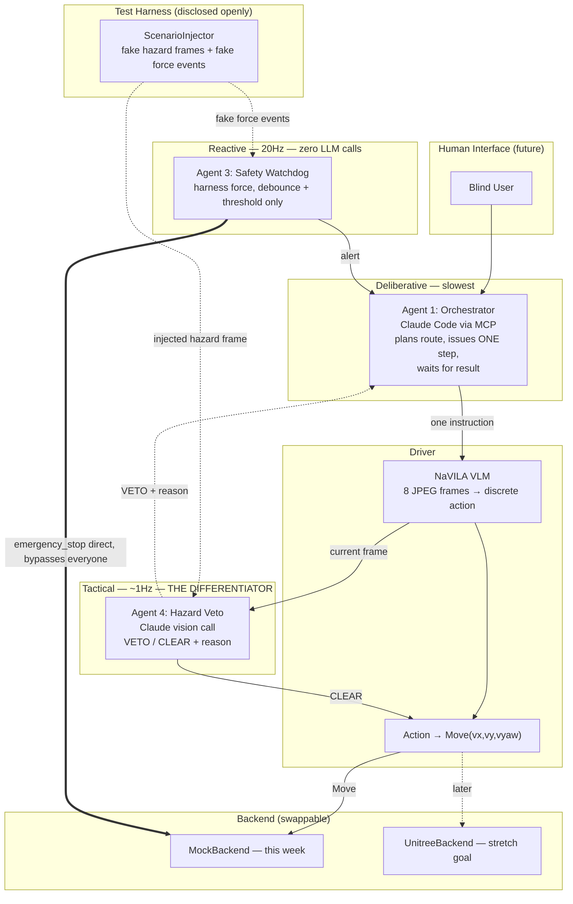

# Guide Dog — Final Plan

## Summary

Four agents, three speeds — this is the pitch in one sentence: **the dog reacts like a
reflex, checks like an instinct, and plans like it's thinking**, and it will refuse an unsafe
instruction the same way a real trained guide dog does. That last part — intelligent
disobedience — is our differentiator; nobody else's nav-robot will have thought to build it.

- **Orchestrator** (Claude Code via MCP) — plans the route, deliberative, slowest.
- **Driver** — NaVILA (vision → 1 of 7 discrete actions) + translates to `Move(vx,vy,vyaw)`.
- **Safety Watchdog** — reactive, ~20Hz, no LLM in the loop, watches (mocked) harness force,
  can emergency-stop directly, bypassing everyone else.
- **Hazard Veto Agent** — tactical, ~1Hz, one Claude vision call per step, can refuse an
  instruction ("red signal," "person crossing") with a stated reason.

Fault injection is our test method, used openly: a `ScenarioInjector` for automated testing,
and something visibly real (in-scene object or a physical prop) for the live demo trigger, so
there's never ambiguity about what judges are watching.

Explicitly cut this week: real hardware, `TrajectoryFollow`, multi-axis force sensing, route
memory, TTS. These are roadmap lines in the pitch, not code. Voice input and caregiver alerts
are also not happening this week either — later, not now, not even as a stretch goal.

## Architecture

## Build order (priority-ordered, not strict daily deadlines — school comes first)

| Stage | Goal | Why this order | Status |
|---|---|---|---|
| 1 | Per-step MCP tools + mock backend | Everything else plugs into this seam. Nothing else can start meaningfully without it. | Mock backend done (A). Per-step MCP tools not started (C). |
| 2 | End-to-end loop on mocks + real Safety Watchdog | Proves the pipeline works before the hard part. | Safety Watchdog done (A). End-to-end loop wiring not started (C). |
| 3 | Hazard Veto Agent + injection harness | The differentiator. Protect the most time here. | Done (A) — see below. |
| 4 | Integration + demo rehearsal | Buffer day. No new features — only fixing and rehearsing the trigger. | Not started. |

## Task delegation

**C — MCP ↔ OrcaLab connection, has Claude Code**
Owns the foundation and the final wiring — the two places that most need someone who already
knows the MCP/OrcaLab connection cold.
- Stage 1: Convert `navila_bridge.py` from one blocking tool into `navigate_step()`,
  `get_status()`, `emergency_stop()`. Root-cause the `json.dumps` TypeError blocking this.
  **Not started.**
- Stage 2: Wire the Orchestrator's per-step loop against the new tools; get one full
  navigate-to-goal cycle working end-to-end on the mock backend. **Not started.**
- Stage 3: Integrate the Veto Agent and Safety Watchdog (built by A) into the loop — gate
  `Move()` on VETO/CLEAR, wire the Watchdog's direct interrupt path. **Blocked on Stage 1/2;
  A's pieces (`SafetyWatchdog`, `HazardVetoAgent`) are ready and tested — see CLAUDE.md, "A's
  components".**

**D — OrcaLab environment and setup**
Owns everything that lives inside the sim itself — plays directly to the existing specialty.
- Stage 1: Make the OrcaLab scene reliably start/reset (needs to run multiple times for
  rehearsal + judges). Check whether the edit service (port 50151) supports writes/spawning
  objects, not just frame capture — needed for stage 3. **Edit-service writes confirmed
  working — see CLAUDE.md.**
- Stage 2: Build the scripted human proxy in the scene (also useful later if harness-force
  realism becomes worth the polish time).
- Stage 3: Build the in-scene hazard trigger (spawn/move a red marker or pedestrian prop on
  command) for the live demo — the "visibly real, not composited" version discussed for the
  judge-facing trigger. Fall back to a physical prop if scene-editing turns out not to be
  supported.

**A — flexible, has Claude Code, pace as feels right**
Self-contained tasks, ordered by priority but each independently buildable and testable without
waiting on C or D — pick up what you can, pause when you need to, nothing here blocks the
others if it moves slower some days.
- ~~Highest priority: the `RobotBackend` interface + `MockBackend` + mock force sensor script
  (small, well-specified, fully standalone).~~ **Done.** `src/navila_orca/robot_backend/`.
- ~~Next: the Safety Watchdog itself (threshold + debounce loop) — test it directly against the
  mock's scripted "force drops to zero" event, no dependency on the rest of the pipeline.~~
  **Done.** `src/navila_orca/safety_watchdog.py`.
- ~~Next: the Hazard Veto Agent + `ScenarioInjector` — can be developed and tested against static
  test images before the full camera pipeline is ready.~~ **Done.** `src/navila_orca/veto/`.
  Note: needs `anthropic` added to `pyproject.toml` before the real Claude-backed client is
  usable end-to-end — parsing/gating/injection all work and are tested without it.
- ~~Lightweight/anytime: the decision logbook (print every stop/veto with a timestamp + reason —
  cheap once the above is logging anyway, and directly answers "how do you know it's making
  good decisions" in Q&A).~~ **Done.** `src/navila_orca/decision_logbook.py`.
- ~~Also good to pick up on a lower-energy day: keeping `CLAUDE.md` updated as things change.~~
  **Done this pass** — `CLAUDE.md` and this file now live in the repo (they previously only
  existed as chat attachments, not committed anywhere).
- Everything A was assigned is now built and unit-tested (59/59 passing,
  `cd NaVILA-Orca && PYTHONPATH=src python3 -m pytest tests/ -q`). Nothing left queued for A
  except picking up integration work once C's per-step tools land, or helping D if D is stuck.

## Stage 4 (everyone)

Integration pass, rehearse the demo trigger until it's reliable on repeat runs, and settle the
pitch narrative — what's built vs. explicitly scoped as roadmap. No new features this stage.
