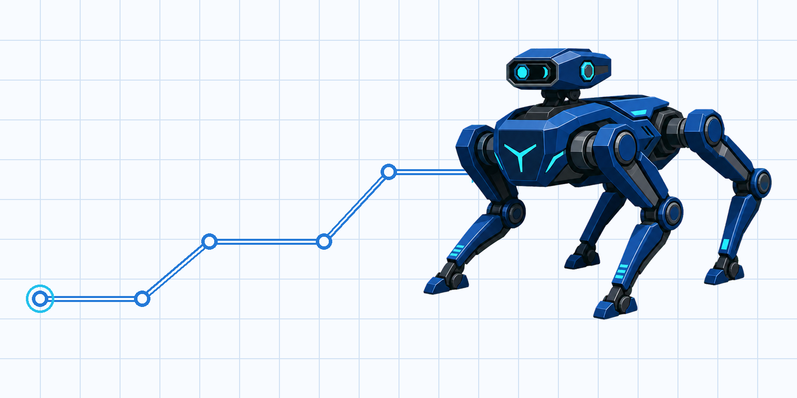
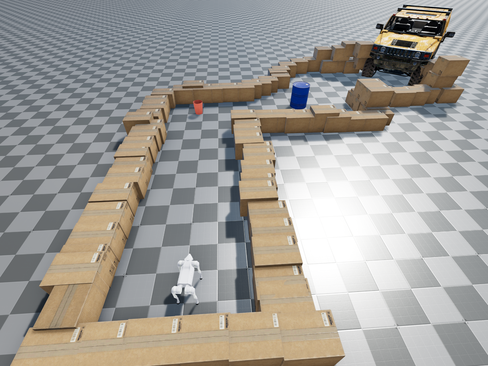
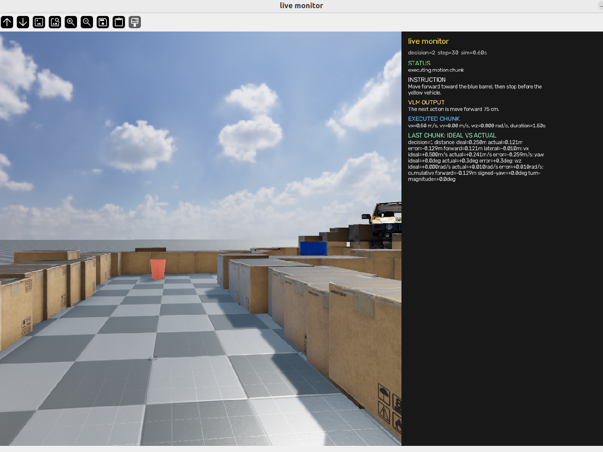
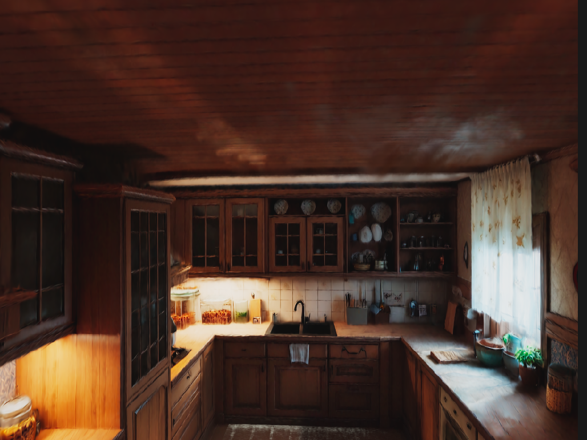
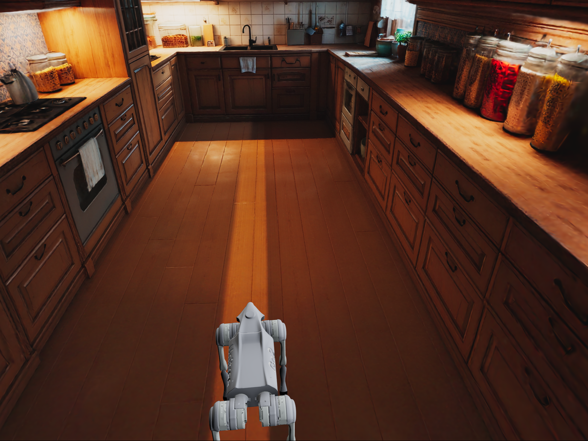
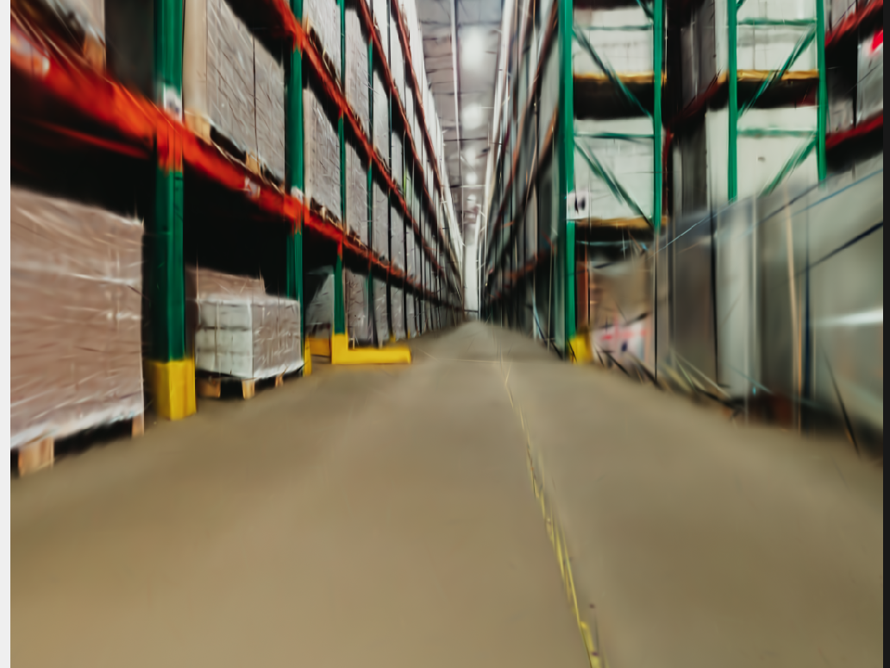
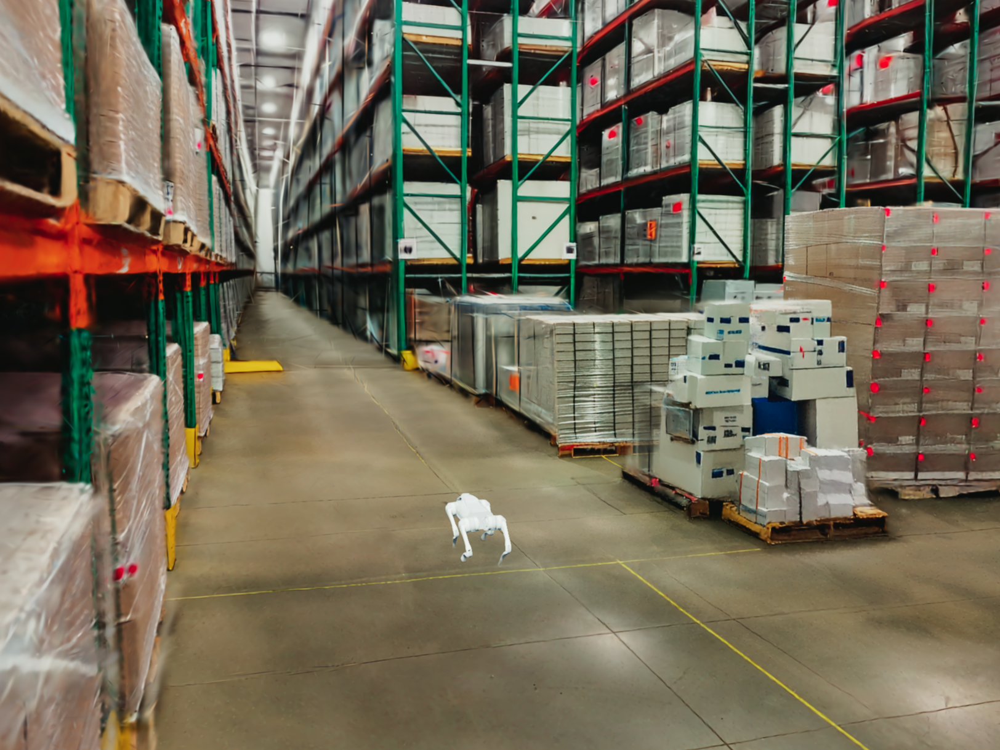
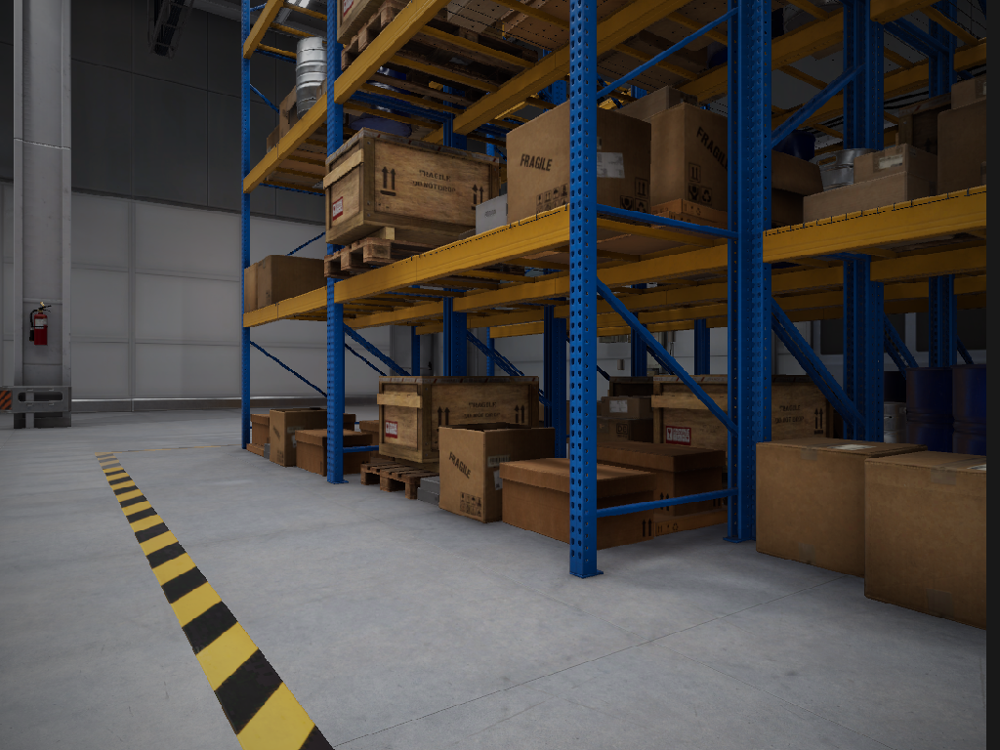
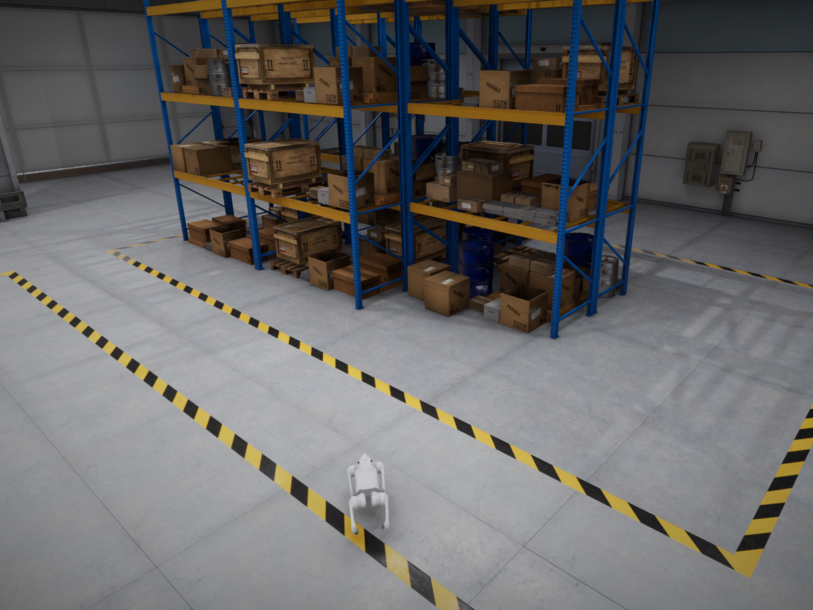

<p align="right"><sub><strong>English</strong> · <a href="README_zh.md">中文</a></sub></p>

<p align="center">
  
  &nbsp;&nbsp;
  
</p>

<h1 align="center">
  
</h1>

<p align="center">
  A visual-language navigation example in OrcaLab.
  <br />
  <a href="#quickstart">🚀 Quickstart</a> ·
  <a href="#competition-baseline">🏁 Competition baseline</a> ·
  <a href="NaVILA-Orca/docs/GETTING_STARTED.md">📚 Docs</a>
</p>

<p align="center">
  
  
</p>

> **Orca_VLN is a baseline VLN example. Fine-tune it for task-specific requirements.**
> NaVILA maps language and ego RGB to the next navigation action; OrcaLab updates the scene and returns the next visual observation.

```text
instruction + ego RGB  →  NaVILA  →  navigation action  →  OrcaLab  →  next ego RGB
```

The repository provides the OrcaLab side of the example: persistent ego observation, scene lifecycle, a default `orcalab_day` episode, a runnable control baseline, and traceable run artifacts. NaVILA stays in its own environment and connects over TCP.

## 🧭 Ego Camera ↔ Simulator Views

Left: the observation received by the VLN policy. Right: the corresponding scene-level simulator view.

<p align="center"><sub><strong>Kitchen navigation</strong></sub></p>
<p align="center">
  
  
</p>

<p align="center"><sub><strong>Warehouse navigation</strong></sub></p>
<p align="center">
  
  
</p>

<p align="center"><sub><strong>Storage navigation</strong></sub></p>
<p align="center">
  
  
</p>

<a id="quickstart"></a>

## 🚀 Quickstart

**Before starting:** use Ubuntu 22.04/24.04 with an NVIDIA GPU whose driver passes `nvidia-smi`, Git, and [Miniconda or Anaconda](https://docs.anaconda.com/miniconda/install/). OrcaLab and NaVILA intentionally use separate Conda prefixes.

### Install once

```bash
git clone https://github.com/openverse-orca/Orca_VLN.git
cd Orca_VLN

# Creates both pinned environments and downloads the reviewed NaVILA model.
./NaVILA-Orca/scripts/setup_all.sh

# Must end with: Orca_VLN installation is ready.
./NaVILA-Orca/scripts/doctor.sh
```

The environments live under this checkout in `.conda/envs/`. The launchers
resolve them from their own file paths; no `ORCA_VLN_ROOT`, `conda activate`,
or manual `deactivate` step is required.

### Run in three terminals

```bash
# A — OrcaLab GUI
./NaVILA-Orca/scripts/start_orcalab_gui.sh
```

```bash
# B — NaVILA service
./NaVILA-Orca/scripts/start_navvlm_server.sh
```

```bash
# C — closed-loop navigation
./NaVILA-Orca/scripts/run_orcalab_scene_locomotion.sh
```

In terminal A, open the default `orcalab_day` map, then choose
**File → Open Layout → [`default_set.json`](NaVILA-Orca/default_set.json)**.
The layout instantiates the reference objects used by the default episode.

<a id="competition-baseline"></a>

## 🏁 Competition baseline

The default episode approaches the blue barrel and stops before the yellow vehicle. It is designed to make the full loop visible: instruction, NaVILA response, executed action, ego camera frames, and saved measurements.

| Evaluation dimension | What teams improve | Baseline status |
| --- | --- | --- |
| **High-level VLN** | prompts, mission logic, inspection behavior, SFT/LoRA | NaVILA action loop is ready to run |
| **Low-level control** | command tracking, turning, stopping, stability, recovery | supplied control model is intentionally general, not navigation-tuned |
| **System evidence** | scene setup, camera capture, action trace, reproducibility | run artifacts are saved automatically |

The supplied control model is a conservative flat-ground baseline. It has not been tuned around this warehouse, NaVILA’s discrete motion chunks, or task-specific stopping accuracy. That gap is intentional: low-level execution quality is a competition metric, not a hidden implementation detail.

## 🧩 Extend the baseline

- [Getting started](NaVILA-Orca/docs/GETTING_STARTED.md) — scene setup, processes, camera, and first run.
- [Hackathon baseline](NaVILA-Orca/docs/HACKATHON_BASELINE.md) — checkpoints, tracks, evidence, and submission scope.
- [High-level VLN](NaVILA-Orca/docs/VLN_FINE_TUNING.md) — reviewed rollout export plus SFT/LoRA direction.
- [Low-level integration](NaVILA-Orca/docs/LOW_LEVEL_LOCOMOTION.md) — train in OrcaLocomotion, IsaacLab, or another platform; align the model through a stable adapter.
- [Architecture](NaVILA-Orca/docs/ARCHITECTURE.md) — the high-level VLN ↔ low-level locomotion contract.

```bash
# Verify the packaged control model, XML, and version alignment.
./scripts/check_mjlab_alignment.sh

# Export a baseline rollout for high-level data review.
python scripts/export_vln_sft_records.py outputs/warehouse_baseline \
  --output data/vln_review_queue.jsonl
```

## 📦 Package

`NaVILA-Orca/` contains the runtime, default global setting, `orcalab_day` episode, robot assets, and baseline checkpoint. Build a clean archive with:

```bash
./scripts/build_kit.sh
```

## 🙌 Acknowledgements

Orca_VLN uses [NaVILA](https://github.com/AnjieCheng/NaVILA) as its high-level vision-language navigation model. If you use NaVILA in your work, please cite:

```bibtex
@inproceedings{cheng2025navila,
  title     = {Navila: Legged robot vision-language-action model for navigation},
  author    = {Cheng, An-Chieh and Ji, Yandong and Yang, Zhaojing and Gongye, Zaitian and Zou, Xueyan and Kautz, Jan and B{\i}y{\i}k, Erdem and Yin, Hongxu and Liu, Sifei and Wang, Xiaolong},
  booktitle = {RSS},
  year      = {2025}
}
```

## 📄 License

Released under the [MIT License](LICENSE).
