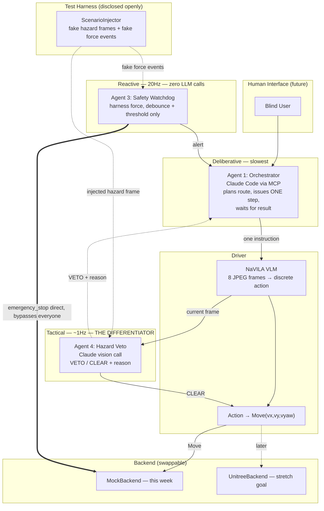

# Guide Dog — Final Plan

## Summary

Four agents, three speeds — this is the pitch in one sentence: **the dog reacts like a
reflex, checks like an instinct, and plans like it's thinking**, and it will refuse an unsafe
instruction the same way a real trained guide dog does. That last part — intelligent
disobedience — is our differentiator; nobody else's nav-robot will have thought to build it.

- **Orchestrator** (Claude Code via MCP) — plans the route, deliberative, slowest.
- **Driver** — NaVILA (vision → 1 of 7 discrete actions) + translates to `Move(vx,vy,vyaw)`.
- **Safety Watchdog** — reactive, ~20Hz, no LLM in the loop, watches (mocked) harness force,
  can emergency-stop directly, bypassing everyone else.
- **Hazard Veto Agent** — tactical, ~1Hz, one Claude vision call per step, can refuse an
  instruction ("red signal," "person crossing") with a stated reason.

Fault injection is our test method, used openly: a `ScenarioInjector` for automated testing,
and something visibly real (in-scene object or a physical prop) for the live demo trigger, so
there's never ambiguity about what judges are watching.

Explicitly cut this week: real hardware, `TrajectoryFollow`, multi-axis force sensing, route
memory, TTS. These are roadmap lines in the pitch, not code. Voice input and caregiver alerts
are also not happening this week either — later, not now, not even as a stretch goal.

## Architecture

## Build order (priority-ordered, not strict daily deadlines — school comes first)

| Stage | Goal | Why this order | Status |
|---|---|---|---|
| 1 | Per-step MCP tools + mock backend | Everything else plugs into this seam. | **Done + merged.** (C) |
| 2 | End-to-end loop on mocks + real Safety Watchdog | Proves the pipeline works before the hard part. | **Done + merged.** (A built the watchdog; C wired it into `navila_navigate_step` + `navila_inject_force_drop` / `navila_get_logbook` / `navila_clear_*`; verified headless, 23/23.) |
| C1 | Per-step loop visible in the OrcaLab GUI | Needed to demo anything; also de-risks the `mjlab` backend. | **Done + merged.** (C — `OrcaLabMirrorBackend`, root-pose mirror; verified live: dog glides, freezes on trip, resumes. Legs don't articulate yet.) |
| C2 | Real gait + real ego-camera frames in the per-step loop | Articulated walking for the demo; frames are the Veto Agent's input. | Not started. **D.** Needs `OrcaLabRenderBridge` (qpos push) + GPU. |
| 3 | Hazard Veto Agent gated into the loop | The differentiator. Protect the most time here. | Components built + tested (A). Gate wiring not started (**C**); needs C2 for real frames but can start on `ScenarioInjector` stubs. |
| 4 | Integration + demo rehearsal | No new features — fixing and rehearsing the trigger. | Not started. Traffic-crossing demo still blocked on D's fork (handoff or re-implement). |

## Task delegation

Done so far: **A** — all four safety/veto components (`robot_backend/`, `safety_watchdog.py`,
`veto/`, `decision_logbook.py`), 59/59 tests. **C** — Stage 1 (per-step MCP tools), Stage 2
(watchdog + logbook + force injection wired into the loop), C1 (OrcaLab GUI pose mirror). All
merged to `main`. `CLAUDE.md` stays at repo root (Claude Code auto-loads it there); other docs
live in `docs/`.

---

**C — orchestration bridge & final wiring** (has Claude Code; owns `navila_bridge.py` +
`bridge_backends.py`)

1. **Stage 3 — veto gate.** In `navila_navigate_step`, after the VLM decision is parsed and
   before the motion chunk, call `HazardVetoAgent.assess(frame, instruction, action_text)`; on
   VETO skip execution, set `termination_reason="veto"`, record via
   `logbook.record_veto_decision`. Add a `NAVILA_BRIDGE_VETO` env toggle (mirror the
   backend/vlm seams) and a `navila_inject_hazard(at_step, duration_steps)` tool that drives
   `ScenarioInjector` the same way `navila_inject_force_drop` drives the force sensor. Start
   now against placeholder frames + a stub `VetoVisionClient` that VETOes on the red bar; swap
   to real frames when D's C2 lands.
2. **`WAYPOINT_STOP_OVERRIDE` precedence.** Add a per-step suppression flag: a `SafetyWatchdog`
   trip or a `VETO` this step sets it, and D's forward-nudge (when it arrives) must honour it.
   Ready it now so D's integration is a drop-in.
3. **C2 seam check.** When D delivers an `orcalab-render` `StepBackend`, confirm
   `_PerStepSession` / `_build_safety_stack` take it unchanged (same `StepBackend` interface —
   they should) and that the watchdog still attaches.

**D — OrcaLab-side code & scene** (has the **Hermes AI** coding assistant; owns everything
inside the sim + the OrcaLab-facing backend code)

D moves up from environment-only to owning OrcaLab code integration — Hermes makes the
implementation tasks below feasible without waiting on C.

1. **C2 — real gait + real ego frames (top priority).** Add a `bridge_backends` kind
   `orcalab-render`: a `StepBackend` that runs `MjlabGo2Backend` for physics and drives
   `OrcaLabRenderBridge` each step — `push_state(state, backend.qpos_batch)` for articulated
   pose in the GUI, and `capture()` for the real RGB frame the per-step loop hands the VLM.
   Model the assembly on `cli.py::_make_renderer` / `_run`. Needs a GPU box + `go2_flat.pt`
   (pair with A for the GPU; the code is D's).
   - **Fallback if the full bridge slips:** real *camera capture only* (via
     `OrcaLabRenderBridge.capture` or `EditServiceWrapper.get_camera_png`) feeding
     `orcalab-mock` inner — unblocks Stage 3 with real frames even before real gait.
2. **Does OrcaLab simulate its own Go2 physics under "Play"?** Answer it. If yes, set the Go2
   externally-driven / kinematic in `D_street.json` so C1's transform mirror survives Play.
3. **In-scene hazard trigger** (was D Stage 3). Script spawn/move of a judge-facing hazard —
   traffic-light state, `blue_hatchback_car_1` crossing, a pedestrian stepping out — via
   `EditServiceWrapper` (`add_actor_batch` / `set_actor_transform_batch`). Expose it as an MCP
   tool or a standalone script C/you can fire during the demo. This is the "visibly real, not
   composited" trigger.
4. **The fork gap.** Either hand over the diverged `cli.py` / `runner.py` / `traffic_crossing.py`
   as a `git bundle`/zip, **or** (faster now, with Hermes) re-implement in this repo:
   `--realtime-visual-sync`, `--rehearsal`, `--traffic-light-crossing`, `--traffic-*-waypoint`,
   and the `WAYPOINT_STOP_OVERRIDE` runner reflex (physical `vx=0.5` for 0.5s on a premature
   stop, honouring C's suppression flag).
5. **Scene reset reliability** (was D Stage 1). Repeatable "reset to authored layout" for
   rehearsal + judges — `save_state`/`restore_state`, or transform write-back to the layout's
   original pose.
6. Scripted human proxy (was D Stage 2) — lower priority; the scene already has static
   pedestrians for the veto agent to react to.

**A — safety/veto components & GPU** (has Claude Code + the GPU box)

1. **`anthropic` dependency.** Add it to `NaVILA-Orca/pyproject.toml`; smoke-test
   `AnthropicVetoVisionClient` on one real saved OrcaLab frame + an API key.
2. **np.ndarray frames.** Make `HazardVetoAgent.assess` / `ScenarioInjector.inject` accept a
   raw `np.ndarray` (the per-step loop's frame type), not just PIL — a small shim in `veto/`,
   removes a conversion burden from C.
3. **GPU partner for C2.** Provide the GPU run for D's `orcalab-render` integration test; if
   A's box can also run the OrcaLab GUI, host the C2 integration there.
4. **Tuning.** Once C2 gives a real loop, set `SafeForceBand` / `debounce_ticks` and the veto
   cadence against measured per-decision NaVILA latency (replace the guessed 120s `vlm_timeout`).

## Stage 4 (everyone)

Integration pass, rehearse the demo trigger until it's reliable on repeat runs, and settle the
pitch narrative — what's built vs. explicitly scoped as roadmap. No new features this stage.
