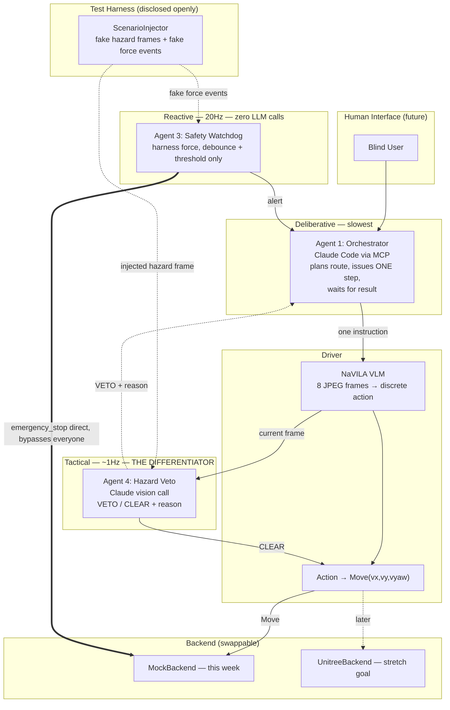

# Guide Dog — Final Plan

## Summary

Four agents, three speeds — this is the pitch in one sentence: **the dog reacts like a
reflex, checks like an instinct, and plans like it's thinking**, and it will refuse an unsafe
instruction the same way a real trained guide dog does. That last part — intelligent
disobedience — is our differentiator; nobody else's nav-robot will have thought to build it.

- **Orchestrator** (Claude Code via MCP) — plans the route, deliberative, slowest.
- **Driver** — NaVILA (vision → 1 of 7 discrete actions) + translates to `Move(vx,vy,vyaw)`.
- **Safety Watchdog** — reactive, ~20Hz, no LLM in the loop, watches (mocked) harness force,
  can emergency-stop directly, bypassing everyone else.
- **Hazard Veto Agent** — tactical, ~1Hz, one Claude vision call per step, can refuse an
  instruction ("red signal," "person crossing") with a stated reason.

Fault injection is our test method: a `ScenarioInjector` for automated testing,
and something visibly real (in-scene object or a physical prop) for the live demo trigger, so
there's never ambiguity about what judges are watching.

Explicitly cut this week: real hardware, `TrajectoryFollow`, multi-axis force sensing, route
memory, TTS. These are roadmap lines in the pitch, not code. Voice input and caregiver alerts
are also not happening this week either — later, not now, not even as a stretch goal.

## Architecture

## Build order (priority-ordered, not strict daily deadlines — school comes first)

| Stage | Goal | Why this order | Status |
|---|---|---|---|
| 1 | Per-step MCP tools + mock backend | Everything else plugs into this seam. | **Done + merged.** (C) |
| 2 | End-to-end loop on mocks + real Safety Watchdog | Proves the pipeline works before the hard part. | **Done + merged.** (A built the watchdog; C wired it into `navila_navigate_step` + `navila_inject_force_drop` / `navila_get_logbook` / `navila_clear_*`; verified headless, 23/23.) |
| C1 | Per-step loop visible in the OrcaLab GUI | Needed to demo anything; also de-risks the `mjlab` backend. | **Done + merged.** (C — `OrcaLabMirrorBackend`, root-pose mirror; verified live: dog glides, freezes on trip, resumes. Legs don't articulate yet.) |
| C2 | Real gait + real ego-camera frames in the per-step loop | Articulated walking for the demo; frames are the Veto Agent's input. | **Split** — real-gait physics (needs GPU — D has one now) → **D**, not started; real camera-capture-only fallback (no GPU needed) → **C**, done + live-verified. See Task delegation. |
| 3 | Hazard Veto Agent gated into the loop | The differentiator. Protect the most time here. | **Done, uncommitted** (**C** — gate wired into `navigate_step` via a stub client on placeholder frames + `WAYPOINT_STOP_OVERRIDE` precedence flag; verified live against the OrcaLab GUI, see `docs/STAGE3_TESTING.md`). Swap to real frames when C2 lands. |
| 4 | Integration + demo rehearsal | No new features — fixing and rehearsing the trigger. | Not started. D's fork is merged (no longer blocking), but the demo is still blocked on C2 (split D + C), the in-scene hazard trigger + scene reset reliability (C), the `NavigationRunner` safety gap (A), and the `hackathon_assets.zip` USD payloads — D delivered her own project's 2 assets (2026-09-05, see D's list), 24 shared-library asset refs + Windows-side install still unverified. |

## Task delegation

Done so far: **A** — all four safety/veto components (`robot_backend/`, `safety_watchdog.py`,
`veto/`, `decision_logbook.py`), 59/59 tests. **C** — Stage 1 (per-step MCP tools), Stage 2
(watchdog + logbook + force injection wired into the loop), C1 (OrcaLab GUI pose mirror), Stage
3 (veto gate + `WAYPOINT_STOP_OVERRIDE` precedence flag — **done but not yet committed**, see
below). **D** — the working fork (traffic-crossing state machine, `--rehearsal` /
`--realtime-visual-sync` / `--traffic-light-crossing` CLI flags, `WAYPOINT_STOP_OVERRIDE`
runner reflex) merged into `main`; the "Does OrcaLab simulate physics under Play" question
answered (no). Stage 1/2/C1/A's components merged to `main`. `CLAUDE.md` stays at repo root
(Claude Code auto-loads it there); other docs live in `docs/`.

**Redelegated this session, twice.** First pass moved everything off D on the assumption her
machine was CPU-only. **Correction: D does have GPU access** (see `CLAUDE.md`'s "Known
technical facts") — the earlier `--device cpu` in her handover command reflected a
constraint at the time, not a permanent limit. Second pass rebalances for as even a 3-way
split as the actual work allows, given each person's real context:
- **C2 split in two**, since it's the single biggest remaining item: the GPU-dependent
  real-gait physics half → **D** (she has the GPU now, and already wrote the `cli.py` render
  assembly this needs to mirror inside `bridge_backends.py` — most-informed owner). The
  GPU-independent real-camera-capture-only fallback half (unblocks real frames for the veto
  gate without needing gait at all) → **C**, who already owns the edit-service connection code
  it plugs into.
- **In-scene hazard trigger + scene reset reliability stay with C** (unchanged from the first
  pass) — same reasoning, plain `EditServiceWrapper` calls into code C already owns.
- **`NavigationRunner` safety-gap / precedence porting → A**, who owns `SafetyWatchdog` and
  `HazardVetoAgent` already — wiring them into a second loop is a natural extension of A's own
  components, not a new subsystem for anyone else to learn.
- Scripted human proxy stays dropped (see "Cut" below D's list) — not reassigned, genuinely not
  needed.
- D also keeps the one thing nobody else can do: exporting the missing asset payloads from her
  own OrcaStudio project. **Done for her own project's 2 assets (2026-09-05)**; the 24
  shared-library refs are a separate account-access question, see D's list item 1.

---

**C — orchestration bridge & final wiring** (has Claude Code; owns `navila_bridge.py` +
`bridge_backends.py`)

1. ~~**Stage 3 — veto gate.**~~ **Done, uncommitted.** `_build_veto_stack` wires
   `HazardVetoAgent` + `ScenarioInjector` into every episode; `navigate_step` gates every
   non-stop decision through `HazardVetoAgent.assess(frame, instruction, action_text)` right
   before the motion chunk, and a VETO ends the step with `termination_reason="veto"` and zero
   physics, recorded via `logbook.record_veto_decision`. Shipped: `NAVILA_BRIDGE_VETO` env
   toggle, `veto`/`veto_client_kind` params on `navila_start_episode`, and
   `navila_inject_hazard`/`navila_clear_hazards` tools mirroring the force-drop ones (hazard
   `at_step` counts *decisions*, not physics ticks). Runs today against placeholder frames +
   a self-contained pixel-detection stub client (`_RedBarStubVetoClient`, no API key needed);
   swapping in `AnthropicVetoVisionClient` is a one-line change to `_make_veto_vision_client`
   once C2 lands. Verified: 7 new tests + full live-GUI pass, see `docs/STAGE3_TESTING.md`.
2. ~~**`WAYPOINT_STOP_OVERRIDE` precedence.**~~ **Done, uncommitted.**
   `session.stop_override_suppressed` — reset `False` every `navigate_step` call, set `True` by
   a watchdog trip or a veto, explicitly *not* set by an ordinary VLM-issued stop. **Scoped as
   inert on purpose**: D's actual override reflex lives in `NaVILA-Orca/src/navila_orca/
   runner.py`'s `NavigationRunner` (the CLI-driven loop, not this per-step bridge) and that
   loop has zero watchdog/veto wiring of its own — this flag is a ready-made suppression check
   for whenever the reflex gets ported into this loop, not a fix to `runner.py`'s live-demo
   safety gap. That gap is still open (see below) and out of scope unless asked. 4 new tests.
3. ~~**C2 — real camera-capture-only fallback (your half of the split).**~~ **Done.**
   `OrcaLabMirrorBackend.capture_frame()` pulls a real RGB frame via the same edit-service
   connection/event-loop already used for pose pushes (`EditServiceWrapper.get_camera_png`
   against a persistent `mujococamera1080` actor — no GPU/MJLab needed), gated by
   `NAVILA_BRIDGE_ORCA_CAMERA` (off by default; `NAVILA_BRIDGE_ORCA_CAMERA_NAME` to override
   the actor). `navila_bridge.py`'s new `_capture_frame()` prefers
   `backend.capture_frame()` when the backend exposes one and falls back to
   `placeholder_frame()` on `None`/an exception/no such method — so `mock`/`mjlab` backends
   are byte-for-byte unaffected. A capture failure degrades to one placeholder frame and
   retries next call; it never blocks the loop. 14 unit tests (6 in `test_navila_bridge.py`
   for the fallback helper, 8 in new `test_bridge_backends.py` for the PNG-read path against
   a fake edit service). **Live-verified 2026-09-05** against D's `street.json` loaded in a
   running OrcaLab GUI: `OrcaLabMirrorBackend(inner_kind="mock", camera=True).capture_frame()`
   returned a real 1080×1080 RGB frame of the actual street scene (pedestrians, traffic light,
   supine_human_model_1, swing set — not a black placeholder). One prerequisite the scene
   doesn't ship with: `mujococamera1080` doesn't exist in `street.json` yet, so it had to be
   spawned once via `add_actor_batch` (asset `prefabs/mujococamera1080`) before capture would
   work — that actor add was live-only (not saved back to `street.json`), so it won't persist
   across a scene reload unless someone explicitly saves/publishes it, or D bakes a permanent
   camera actor into the authored scene. Real frames now also unblock `vlm_kind="tcp"` in the
   per-step loop (it previously refused placeholder frames, see
   `_is_placeholder_frame`/`TcpVLM`) — untested end-to-end with the real VLM yet, just the
   frame-capture half.
4. **C2 seam check (D's half).** When D delivers the real-gait `orcalab-render`
   `StepBackend`, confirm `_PerStepSession` / `_build_safety_stack` take it unchanged (same
   `StepBackend` interface — they should) and that the watchdog still attaches. Blocked on D;
   nothing to do yet.
5. ~~**In-scene hazard trigger.**~~ **Done, live-verified.** New MCP tool
   `navila_trigger_scene_hazard(actor_name, x, y, z, yaw_deg=0.0)` moves an existing scene
   actor (e.g. `blue_hatchback_car_1`) to a world pose via `EditServiceWrapper.
   set_actor_transform_batch` — the same verified write path as the pose mirror, but a new
   standalone `bridge_backends.trigger_scene_hazard()` function that opens/closes its own
   edit-service connection per call (fires once or twice a demo run, so a fresh connection
   beats managing a persistent background thread for something this infrequent) rather than
   reusing `OrcaLabMirrorBackend`'s. Deliberately independent of the per-step episode/backend —
   works regardless of `backend_kind` or whether an episode is even running. Unlike the pose
   mirror's silent-degrade contract, a connection/write failure here is surfaced as
   `ok: False` with the error (never raises past the MCP tool), since a demo trigger the
   operator can't see fire needs to be visible when it fails. Only moves an *existing* actor
   (`set_actor_transform_batch`) — spawning a brand-new one via `add_actor_batch` was left out
   for now since that API path isn't verified anywhere in this codebase yet and D's hazard cast
   (street.json) already has every actor this needs (traffic lights, `blue_hatchback_car_1`,
   pedestrian models, `supine_human_model_1`) as a pre-placed, moveable actor. 9 new tests (5
   in `test_bridge_backends.py` against a fake edit service, 4 in `test_navila_bridge.py` for
   the impl's validation/error-shape). **Live-verified 2026-09-05**: called
   `trigger_scene_hazard` against the running scene to move `blue_hatchback_car_1` next to
   `quadruped_robot_1`, confirmed the write server-side (`get_actor_property_groups_batch`
   readback matched exactly) AND visually in the OrcaLab GUI (user confirmed), then restored
   the car to its authored position from `street.json`.
6. **Scene reset reliability.** Repeatable "reset to authored layout" for
   rehearsal + judges — `EditServiceWrapper.save_state`/`restore_state`, or transform
   write-back to the layout's original pose (the same mechanism already used to fix the
   Go2 pose-reset-between-runs bug). Confirmed genuinely unbuilt — zero
   `save_state`/`restore_state` usage anywhere in the repo yet.

**D — OrcaLab-side code & scene** (has the **Hermes AI** coding assistant; owns everything
inside the sim + the OrcaLab-facing backend code)

1. ~~**`hackathon_assets.zip`'s scene is visually incomplete — needs D's action.**~~
   **Partially done, 2026-09-05.** The user unzipped it and loaded `street.json` into a live
   OrcaLab GUI; most actors render as missing/placeholder. Root cause: `street.json` is only
   the scene graph (transforms + `asset_path` references into OrcaStudio's managed asset
   service) — it does not embed the actual USD geometry/texture payloads. D has since sent
   `private_asset_transfer/` (untracked, gitignored — proprietary, not for commit): an updated
   `street.json` (now 26 unique `asset_path` refs, up from 20) plus real `.pak` payloads for
   the 2 assets private to her own `simplifynext_hackathon` project — `traffic_light_202608270102_usda`
   and a renamed/replacement road, `road2_202609041615_usda` (was `asphalt_road_202608270155_usda`).
   Hashes verified against the bundle's own `SHA256SUMS.txt`. **Still open:** the other 24
   `asset_path` refs (`remy`, `remy_liedown`, `go2_usda`, `cardbox_02_static`, `barrel_blue_01`,
   `coolingrib_01_d`, 19 unnamed `default_project/prefabs/a_<hash>_usda`) live under a
   *different* project id (`e071469a36d3c8aa`) — per D's own transfer README this needs normal
   OrcaStudio account access to that shared project, not another export; unconfirmed whether
   the recipient's account already has it. `go2` is very likely fine regardless (bundled with
   every install of this fork). **Also still open:** the actual Windows-side install (copying
   the `.pak`s into `%LOCALAPPDATA%\Orca\OrcaStudio\{GUID}\Cache\pc`) can only happen on a
   native Windows OrcaLab machine — not verified end-to-end, so it's unconfirmed that even the
   2 covered assets render correctly post-install. Next action for D: confirm whether
   `e071469a36d3c8aa` is a shared team project or needs its own export/invite.
2. **C2 — real gait (your half of the split, see "Redelegated" above; top priority).** Add a
   `bridge_backends` kind `orcalab-render`: a `StepBackend` that runs `MjlabGo2Backend` for
   physics and drives `OrcaLabRenderBridge.push_state(state, backend.qpos_batch)` each step for
   articulated pose in the GUI. Model the assembly on `cli.py::_make_renderer` / `_run` — the
   exact pattern already in your own fork's CLI path, so this is largely porting/adapting code
   you've already written into `bridge_backends.py`'s `StepBackend` shape rather than building
   from scratch. Needs `go2_flat.pt` + your GPU. C owns the parallel camera-capture-only half
   (see C's list) and the seam check once this lands.
3. ~~Does OrcaLab simulate its own Go2 physics under "Play"?~~ **Answered: no.** Confirmed by
   the user — no second physics authority fighting C1's transform mirror, no scene change
   needed. See CLAUDE.md's "Known technical facts."
4. ~~**The fork gap.**~~ **Done.** D's actual working fork (branch `daphne-demo-ready`) was
   merged into `main` this session — `--realtime-visual-sync`, `--rehearsal`,
   `--traffic-light-crossing`, `--traffic-*-waypoint`, and the `WAYPOINT_STOP_OVERRIDE` runner
   reflex are all in-repo now (`NaVILA-Orca/src/navila_orca/{cli,runner,traffic_crossing}.py`).
   One thing the merge had to fix by hand: D's branch predated A's Stage-2 safety commits and
   had silently dropped `MjlabGo2Backend.interrupted`/`.emergency_stop()` — restored, since
   `bridge_backends.py`'s C2 seam and `SafetyWatchdog` both depend on it. The reflex still
   doesn't honour C's suppression flag (C's item 2 above) — porting it in is A's item 3 above —
   that wiring is open, not done by the merge.

**Cut, not reassigned:** scripted human proxy (was D Stage 2) — the scene already has static
pedestrians for the veto agent to react to, so this isn't needed for the differentiator to
work. Drop it rather than give it to anyone; revisit only if there's spare time later.

**A — safety/veto components & GPU** (has Claude Code + the GPU box)

1. **`anthropic` dependency.** Add it to `NaVILA-Orca/pyproject.toml`; smoke-test
   `AnthropicVetoVisionClient` on one real saved OrcaLab frame + an API key.
2. **np.ndarray frames.** Make `HazardVetoAgent.assess` / `ScenarioInjector.inject` accept a
   raw `np.ndarray` (the per-step loop's frame type), not just PIL — a small shim in `veto/`,
   removes a conversion burden from C. Not blocking anymore — C's veto gate wiring added its
   own local `_veto_frame()` conversion in `navila_bridge.py` rather than wait on this, but the
   shim is still worth doing for cleanliness/reuse elsewhere.
3. **`NavigationRunner` safety-gap / precedence porting (your share of the split, see
   "Redelegated" above).** D's live demo command runs through `NavigationRunner` (the CLI
   loop, not the per-step MCP bridge), which today has zero `SafetyWatchdog`/`HazardVetoAgent`
   wiring — so the `WAYPOINT_STOP_OVERRIDE` forward-nudge reflex there has nothing stopping it
   from overriding a real safety stop. Port your own components into that loop (mirroring how
   C already wired them into `navila_bridge.py`'s `navigate_step` this session — see
   `docs/STAGE3_TESTING.md` for the pattern) and gate the reflex on a trip/veto having occurred,
   the same way `session.stop_override_suppressed` is meant to. You own `SafetyWatchdog` and
   `HazardVetoAgent` already, so this is closing a gap in your own components' coverage, not
   learning a new subsystem.
4. **Tuning.** Once C2 gives a real loop, set `SafeForceBand` / `debounce_ticks` and the veto
   cadence against measured per-decision NaVILA latency (replace the guessed 120s `vlm_timeout`).

## Stage 4 (everyone)

Integration pass, rehearse the demo trigger until it's reliable on repeat runs, and settle the
pitch narrative — what's built vs. explicitly scoped as roadmap. No new features this stage.
